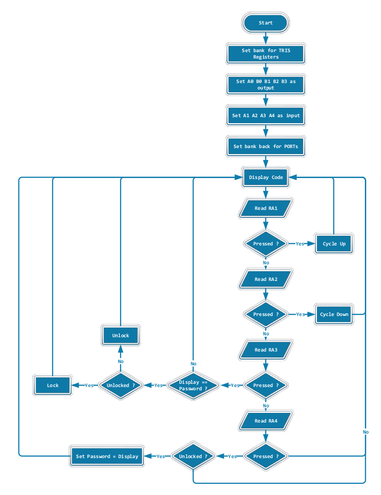

# lock-pic
PIC: Storage Lock Controller

**_Assemby program for PIC16F628A._**

## Usage
This is a simply locking system controlled by PIC16F628A. User can cycle up and down using A1 and A2 buttons, select the displayed code using A3 button. If user presses the select button while displayed code equals the predefined password code, system will become unlocked and A0 LED will be turn on. If the system is unlock already, it will become locked and A0 LED will turn off. If user presses A4 while system is unlocked, the password will be updated with the displayed value.

> [PICSimLab](https://sourceforge.net/projects/picsim/) can be used for testing.

## Flowchart

